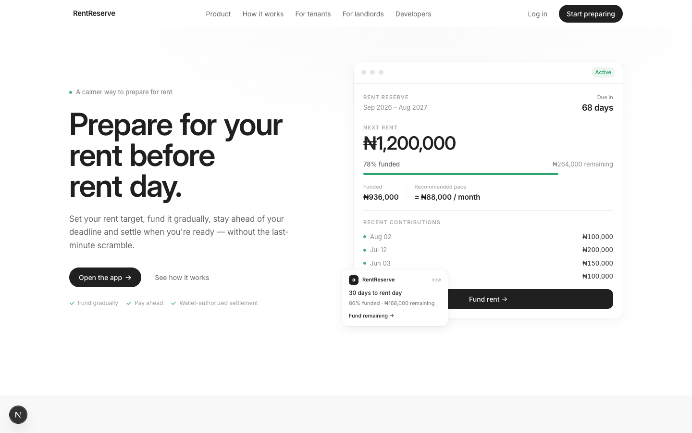
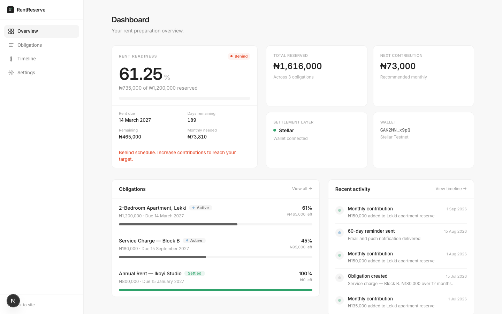
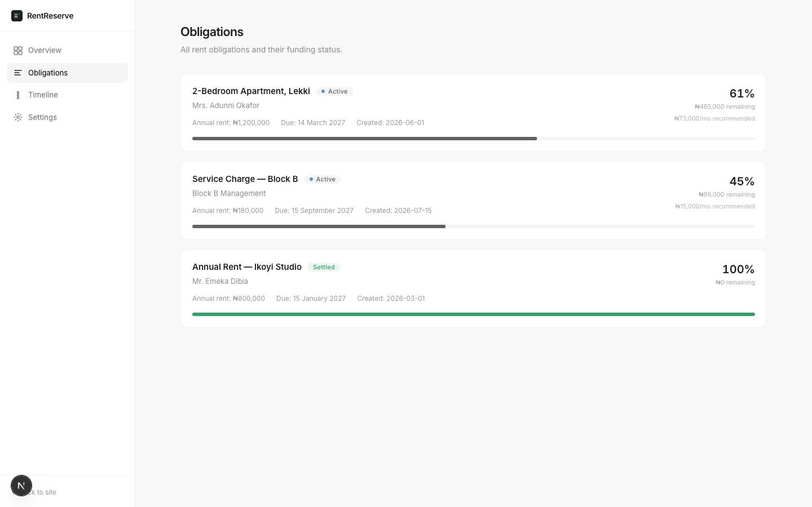
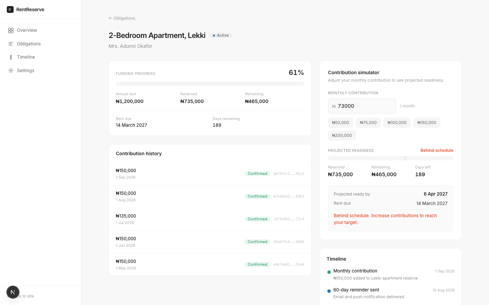
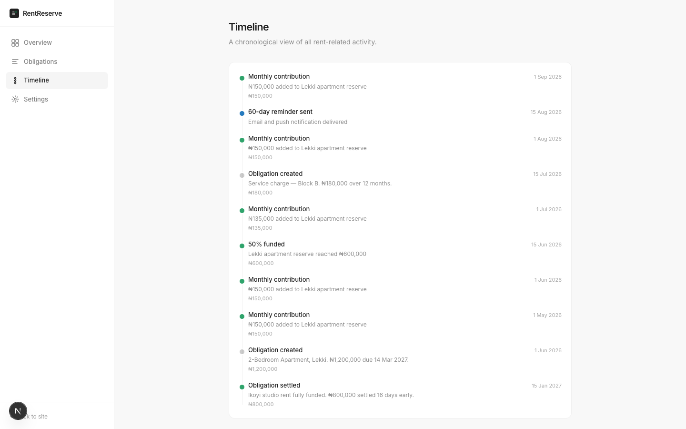
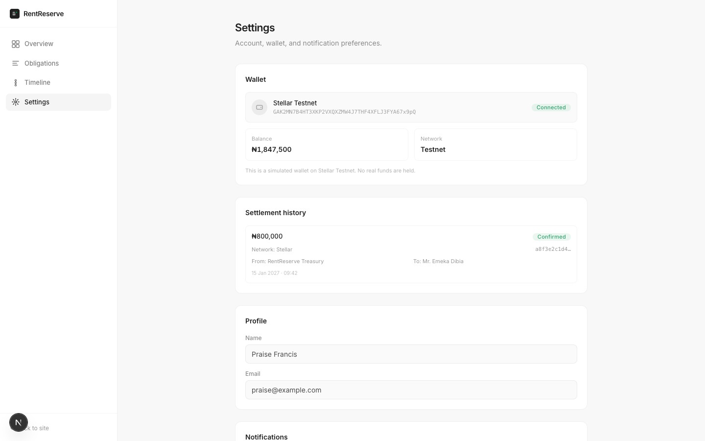
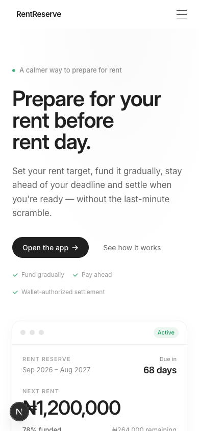
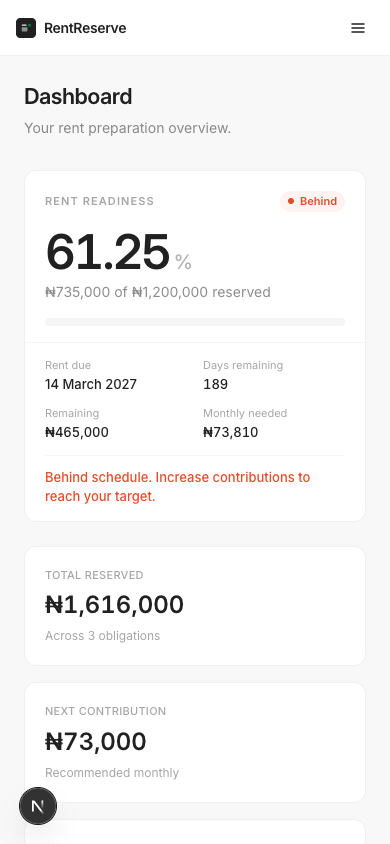

# RentReserve

> **Prepare for rent before rent day.**

RentReserve is a programmable rent-obligation platform built on Stellar/Soroban for Nigeria's annual rent market.

Annual rent creates a large, predictable financial obligation. RentReserve lets users define that obligation and prepare for it gradually — with Stellar/Soroban providing the programmable settlement layer.

---

## Screenshots

| Landing Page | Dashboard | Obligations |
|---|---|---|
|  |  |  |

| Detail + Simulator | Timeline | Settings |
|---|---|---|
|  |  |  |

| Mobile Landing | Mobile Dashboard |
|---|---|
|  |  |

---

## Why Stellar?

Stellar/Soroban provides the programmable infrastructure for rent obligations:

- **Smart contract** — defines obligation state, authorized contributions, and settlement rules
- **Wallet authorization** — users sign transactions, no custodial key management
- **Verifiable settlement** — every settlement produces an on-chain transaction record
- **Low fees** — suitable for micro-contributions toward rent

The contract manages the full lifecycle: create → accept → contribute → settle → verify.

---

## What is implemented?

| Layer | Status |
|---|---|
| Soroban smart contract | **Implemented** — full lifecycle, 24 tests passing, [deployed to testnet](https://stellar.expert/explorer/testnet/contract/CDCIUAVJWNXRR6BTULG4SWFQQQTKAGUYTHMCUDDWTYRNH46YBGPFFWMI) |
| TypeScript SDK | **Implemented** — client abstraction for contract interactions |
| REST API | **Implemented** — Express + Prisma, obligation routes |
| Event indexer | **Implemented** — Stellar Horizon polling with cursor persistence |
| Notification engine | **Implemented** — 7-tier reminder scheduling |
| PostgreSQL schema | **Implemented** — 14 models via Prisma |
| Landing page | **Implemented** — 17-section editorial experience |
| Application UI | **Implemented** — dashboard, obligations, timeline, settings |
| Product visualizations | **Implemented** — rent readiness, contribution simulator |

---

## What is simulated?

- **Wallet connection** — currently uses mock data; Freighter SDK integration planned
- **Settlement transactions** — UI shows Stellar transaction hashes but does not submit real transactions yet
- **Contribution funding** — the simulator demonstrates the calculation; actual funding requires wallet integration
- **Notifications** — the scheduling engine exists but is not connected to a production email/SMS provider

The smart contract is fully implemented, tested, and deployed to Stellar Testnet. The frontend demonstrates the intended product experience with realistic mock data while wallet and settlement integration are completed.

---

## Getting started

### Prerequisites

- Node.js 18+
- Rust + Cargo
- PostgreSQL
- Stellar/Soroban CLI

### Setup

```bash
git clone https://github.com/florence2peter/rent-reserve.git
cd rent-reserve
npm install
```

### Run the landing page

```bash
cd rentreserve
npm run dev
# http://localhost:3000
```

### Run the smart contract tests

```bash
cd packages/contracts
cargo test
```

### Run the API

```bash
cd apps/api
cp .env.example .env
# Configure DATABASE_URL in .env
npx prisma migrate dev
npm run dev
# http://localhost:3001
```

---

## Repository structure

```text
rent-reserve/
├── packages/
│   ├── contracts/          # Soroban smart contract (Rust)
│   │   ├── src/lib.rs      # Contract implementation
│   │   └── src/tests.rs    # 24 contract tests
│   ├── sdk/                # TypeScript SDK
│   └── types/              # Shared TypeScript types
├── apps/
│   └── api/                # Express API + Prisma + notifications
├── rentreserve/            # Next.js 16 landing page + app routes
│   ├── app/                # Routes (/, /app/dashboard, /app/obligations, ...)
│   ├── components/         # Sections, motion, product-ui, shared
│   └── lib/                # Tokens, hooks, mock data
├── docs/                   # Architecture documentation
├── screenshots/            # Product screenshots
└── scripts/                # Deployment scripts
```

---

## Contributing

See [CONTRIBUTING.md](CONTRIBUTING.md) for development setup and guidelines.

### Good first issues

We maintain a backlog of contributor-sized work on GitHub Issues. These are scoped for independent implementation during Wave sprint cycles:

| Issue | Complexity | Points |
|---|---|---|
| [#1](https://github.com/florence2peter/rent-reserve/issues/1) — Soroban contract test suite | High | 200 |
| [#2](https://github.com/florence2peter/rent-reserve/issues/2) — CI/CD pipeline | Medium | 150 |
| [#3](https://github.com/florence2peter/rent-reserve/issues/3) — Stellar wallet connection (Freighter) | High | 200 |
| [#4](https://github.com/florence2peter/rent-reserve/issues/4) — Email templates for reminders | Medium | 150 |
| [#5](https://github.com/florence2peter/rent-reserve/issues/5) — API rate limiting & validation | Medium | 150 |
| [#6](https://github.com/florence2peter/rent-reserve/issues/6) — Interactive architecture diagram | Medium | 150 |
| [#7](https://github.com/florence2peter/rent-reserve/issues/7) — Mobile responsive audit | Trivial | 100 |
| [#8](https://github.com/florence2peter/rent-reserve/issues/8) — WCAG 2.1 AA accessibility | Medium | 150 |
| [#9](https://github.com/florence2peter/rent-reserve/issues/9) — Horizon SSE streaming indexer | High | 200 |
| [#10](https://github.com/florence2peter/rent-reserve/issues/10) — Landing page simulator section | Medium | 150 |

Each issue includes: description, context, step-by-step implementation, example commit message, and acceptance criteria.

---

## License

MIT — see [LICENSE](LICENSE).

---

## Detailed documentation

The sections below provide comprehensive technical reference for the full implementation.

* [Product Vision](#product-vision)
* [The Problem](#the-problem)
* [The RentReserve Model](#the-rentreserve-model)
* [Core Product Principles](#core-product-principles)
* [Product Lifecycle](#product-lifecycle)
* [Features](#features)
* [Architecture](#architecture)
* [System Boundaries](#system-boundaries)
* [Technology Stack](#technology-stack)
* [Repository Structure](#repository-structure-1)
* [Smart Contract](#smart-contract)
* [API Backend](#api-backend)
* [SDK](#sdk)
* [Database](#database)
* [Local Development](#local-development)
* [Testing](#testing)
* [Deployment](#deployment)
* [Security](#security)
* [Known Limitations](#known-limitations)
* [Future Roadmap](#future-roadmap)

---

# Product Vision

RentReserve exists to change the mental model around rent.

Traditional rent payment works like this:

```text
WAIT
  ↓
RENT DEADLINE APPROACHES
  ↓
FIND LARGE AMOUNT
  ↓
PAY
```

RentReserve introduces a preparation layer:

```text
CREATE OBLIGATION
       ↓
SET TARGET + DEADLINE
       ↓
PLAN
       ↓
FUND GRADUALLY
       ↓
TRACK PROGRESS
       ↓
RECEIVE REMINDERS
       ↓
SETTLE
       ↓
VERIFY
```

The platform does not fundamentally change the landlord's rent obligation.

Instead, it changes **when and how the tenant prepares for that obligation**.

The central product principle is:

> **The goal isn't to change how rent works. It's to give people more time to prepare for it.**

---

# The Problem

A major problem with annual rent is not necessarily the total amount.

It is the timing.

A tenant may receive income:

* Weekly
* Biweekly
* Monthly
* From multiple sources
* Through irregular business income

But the rent obligation may arrive as one large payment.

For example:

```text
Monthly income

Jan    ███████████
Feb    █████████
Mar    ███████████
Apr    ██████████
May    ███████████
Jun    █████████
Jul    ██████████
Aug    ███████████
Sep    ██████████
Oct    █████████
Nov    ███████████
Dec    ██████████


Annual rent obligation

₦1,200,000
████████████████████████████████
```

The income arrives incrementally.

The obligation arrives as a lump sum.

RentReserve bridges this timing mismatch by allowing the tenant to treat the future rent obligation as something that can be prepared for continuously.

---

# The RentReserve Model

A RentReserve is a defined financial obligation.

An obligation contains:

```text
Tenant
Landlord
Property
Target Amount
Funding Progress
Due Date
Status
Contributions
Settlement
Verification
```

A simplified lifecycle looks like:

```text
                  ┌──────────────┐
                  │    CREATE    │
                  └──────┬───────┘
                         ↓
                  ┌──────────────┐
                  │    ACCEPT    │
                  └──────┬───────┘
                         ↓
                  ┌──────────────┐
                  │     FUND     │
                  └──────┬───────┘
                         ↓
                  ┌──────────────┐
                  │    TRACK     │
                  └──────┬───────┘
                         ↓
                  ┌──────────────┐
                  │   SETTLE     │
                  └──────┬───────┘
                         ↓
                  ┌──────────────┐
                  │    VERIFY    │
                  └──────────────┘
```

The system must preserve the relationship between the **obligation**, its **funding history**, and its **final settlement**.

---

# Core Product Principles

## 1. Preparation over panic

The product should make future rent feel manageable rather than urgent.

## 2. Gradual funding

Users do not need to make one perfect payment.

Multiple contributions belong to the same obligation.

## 3. User authorization

Users remain responsible for authorizing transactions.

The system should not imply custodial control over user funds.

## 4. Transparent progress

At every point the user should be able to answer:

* How much is required?
* How much has been funded?
* How much remains?
* When is it due?
* Am I on track?
* What should I do next?

## 5. Verifiable settlement

Settlement should produce a verifiable transaction record.

## 6. Blockchain where it matters

The product should not expose blockchain complexity unnecessarily.

Stellar/Soroban provides the programmable settlement and verification layer while the application handles the user experience, scheduling, presentation, and off-chain metadata.

---

# Product Lifecycle

## Step 1 — Create

The tenant defines:

```text
Amount
Due date
Property
Landlord
```

Example:

```text
Rent amount: ₦1,200,000
Due date: 15 September 2027
Property: 2-bedroom apartment
Landlord: Landlord account
```

---

## Step 2 — Accept

The landlord reviews the obligation and accepts it.

The obligation becomes eligible for funding.

---

## Step 3 — Fund

The tenant contributes toward the obligation.

Example:

```text
Contribution 1    ₦100,000
Contribution 2    ₦75,000
Contribution 3    ₦200,000
Contribution 4    ₦150,000
Contribution 5    ₦275,000

Total             ₦800,000
```

The obligation remains the same.

Only its funding progress changes.

---

## Step 4 — Track

RentReserve continuously calculates:

```text
Target amount
Funded amount
Remaining amount
Funding percentage
Days remaining
Recommended funding pace
```

---

## Step 5 — Settle

When the obligation is fully funded, the tenant can settle before the deadline.

The user should not have to wait until the actual rent deadline.

---

## Step 6 — Verify

The final settlement produces a verifiable record.

The application can associate:

```text
Obligation
Settlement
Transaction
Timestamp
Amount
Participants
```

---

# Features

| Feature                | Description                          | Status      |
| ---------------------- | ------------------------------------ | ----------- |
| Rent Obligations       | Define a future rent liability       | Active      |
| Gradual Funding        | Make multiple contributions          | Active      |
| Smart Reminders        | Deadline-aware funding reminders     | Active      |
| Funding Progress       | Track obligation completion          | Active      |
| Early Settlement       | Settle once fully funded             | Active      |
| Landlord Visibility    | Show obligation progress             | Active      |
| Wallet Authorization   | User-authorized Stellar transactions | Active      |
| Batch Settlement       | Settle multiple obligations together | Coming Soon |
| Shared Contributions   | Multiple authorized contributors     | Coming Soon |
| Scheduled Funding      | Programmable recurring contributions | Planned     |
| Advanced Notifications | More contextual notification rules   | Planned     |

---

# Architecture

RentReserve uses a layered architecture.

```text
┌─────────────────────────────────────────────────────────────┐
│                        RENTRESERVE                          │
├─────────────────────────────────────────────────────────────┤
│                                                             │
│                       FRONTEND                              │
│                                                             │
│        ┌──────────────────┐   ┌──────────────────┐          │
│        │   Tenant App     │   │ Landlord Portal  │          │
│        └────────┬─────────┘   └────────┬─────────┘          │
│                 │                      │                    │
│                 └──────────┬───────────┘                    │
│                            │                                │
│                      APPLICATION API                        │
│                            │                                │
│             ┌──────────────┼──────────────┐                 │
│             │              │              │                 │
│             ▼              ▼              ▼                 │
│         PostgreSQL     Scheduler       Notifier             │
│             │                                              │
│             └──────────────────┬───────────────────────────┘
│                                │                            │
│                         STELLAR GATEWAY                     │
│                                │                            │
│                         ┌──────▼──────┐                     │
│                         │   SOROBAN   │                     │
│                         │  CONTRACT   │                     │
│                         └──────┬──────┘                     │
│                                │                            │
│                         ┌──────▼──────┐                     │
│                         │   STELLAR   │                     │
│                         │   NETWORK   │                     │
│                         └─────────────┘                     │
│                                                             │
│                     EVENT INDEXER                           │
│                            │                                │
│                            ▼                                │
│                       PostgreSQL                            │
└─────────────────────────────────────────────────────────────┘
```

---

# System Boundaries

RentReserve deliberately separates responsibilities.

## Frontend

Responsible for:

* User interface
* Product storytelling
* Visualization
* Interaction
* Client-side state
* Accessibility
* Responsive presentation

## API

Responsible for:

* Application business logic
* Persistence
* Validation
* Authentication
* Notification scheduling
* Query aggregation
* Blockchain coordination

## Database

Responsible for:

* User records
* Obligation metadata
* Contributions
* Settlement records
* Notifications
* Indexed blockchain events
* Audit information

## Soroban

Responsible for:

* Obligation state enforcement
* Authorized contract operations
* Contributions
* Settlement
* Cancellation
* On-chain state
* Event emission

## Stellar

Responsible for:

* Transaction settlement
* Network verification
* On-chain transaction history

---

# Technology Stack

| Layer           | Technology           |
| --------------- | -------------------- |
| Frontend        | Next.js              |
| Framework       | Next.js 16.3.4       |
| React           | React 19.2.8         |
| Language        | TypeScript 5.x       |
| Styling         | Tailwind CSS v4      |
| Animation       | Framer Motion 13.2.0 |
| Backend         | Node.js              |
| API             | Express              |
| Database        | PostgreSQL           |
| ORM             | Prisma 5.22.0        |
| Smart Contract  | Rust + Soroban       |
| Soroban SDK     | 28.0.0-rc.1          |
| Blockchain      | Stellar Testnet      |
| Package Manager | npm workspaces       |
| Build Tool      | Turbopack            |

---

# Repository Structure

```text
rentreserve/
│
├── apps/
│   └── api/
│       ├── prisma/
│       │   └── schema.prisma
│       │
│       ├── src/
│       │   ├── index.ts
│       │   ├── database/
│       │   ├── modules/
│       │   ├── stellar/
│       │   └── jobs/
│       │
│       ├── .env.example
│       └── package.json
│
├── packages/
│   │
│   ├── contracts/
│   │   ├── src/
│   │   │   ├── lib.rs
│   │   │   └── tests.rs
│   │   ├── test_snapshots/
│   │   └── Cargo.toml
│   │
│   ├── sdk/
│   │   ├── src/
│   │   │   ├── contract.ts
│   │   │   └── types.ts
│   │   └── package.json
│   │
│   └── types/
│       ├── src/
│       │   └── index.ts
│       └── package.json
│
├── rentreserve/
│   ├── app/
│   │   ├── layout.tsx
│   │   ├── page.tsx
│   │   └── globals.css
│   │
│   ├── components/
│   │   ├── navigation/
│   │   ├── hero/
│   │   ├── sections/
│   │   ├── motion/
│   │   └── footer/
│   │
│   ├── tailwind.config.ts
│   ├── postcss.config.mjs
│   ├── next.config.ts
│   └── package.json
│
├── scripts/
│   ├── deploy-contract.sh
│   ├── deploy-api.sh
│   └── setup-db.sh
│
├── README.md
├── IMPLEMENTATION_SPEC.md
├── CONTRIBUTING.md
├── SECURITY.md
├── LICENSE
└── package.json
```

---

# Landing Page

The RentReserve landing page is a **single-page editorial product experience**.

There is one route:

```text
/
```

The page is vertically composed of product-storytelling sections.

The navigation uses anchor links to move between sections.

```text
#product
#how-it-works
#tenants
#landlords
#developers
#security
#start
#login
```

The page intentionally avoids conventional SaaS design patterns such as:

* Excessive gradients
* Stock photography
* Large image-based product screenshots
* Decorative illustrations
* Heavy shadows
* Excessive rounded containers
* Loud brand colors

Instead, the visual language is:

> **Editorial + technical + restrained + premium.**

---

# Landing Page Design System

## Visual Direction

The landing page uses:

* White surfaces
* Near-black typography
* Hairline borders
* Subtle gray backgrounds
* Restrained green status accents
* Inter for interface typography
* Georgia for editorial moments
* Code-built product visualizations
* Fine-grain motion
* Large typography
* Generous whitespace

The product should feel like a **premium financial infrastructure product presented through an editorial magazine**.

---

# Color System

```css
--color-canvas: 255 255 255;
--color-canvas-subtle: 252 252 252;
--color-canvas-muted: 248 248 248;
--color-canvas-footer: 247 247 247;

--color-text-primary: rgba(0, 0, 0, 0.875);
--color-text-secondary: rgba(0, 0, 0, 0.608);
--color-text-muted: rgba(0, 0, 0, 0.45);

--color-hairline: rgba(0, 0, 0, 0.06);
--color-hairline-strong: rgba(0, 0, 0, 0.10);

--color-positive: rgba(0, 143, 74, 0.81);
--color-negative: rgba(223, 38, 0, 0.82);
```

Additional semantic accents:

```text
Green
→ Success
→ Funding
→ Verification
→ Settlement

Orange
→ Warning
→ Coming soon
→ Funding attention

Blue
→ Planned
→ Tracking
→ Informational state
```

The accents should remain restrained.

The page should never become visually colorful.

---

# Typography

## Primary Typeface

**Inter Variable**

Used for:

* Navigation
* Body copy
* Buttons
* Labels
* Product interfaces
* Headings
* Metadata

## Editorial Typeface

**Georgia**

Used selectively for:

* Large quotations
* Editorial moments
* Narrative pauses

---

# Type Scale

| Element    |                     Size |  Weight |   Tracking |
| ---------- | -----------------------: | ------: | ---------: |
| Hero       | `clamp(42px,5.5vw,64px)` |     600 |  `-0.03em` |
| Section    |   `clamp(26px,3vw,38px)` |     600 | `-0.025em` |
| Large      | `clamp(28px,3.5vw,42px)` |     600 | `-0.025em` |
| CTA        |   `clamp(32px,4vw,52px)` |     600 |  `-0.03em` |
| Quote      | `clamp(28px,3.8vw,44px)` |     400 |  `-0.01em` |
| Subheading | `clamp(22px,2.5vw,32px)` |     600 |  `-0.02em` |
| Body       |                  16–17px |     400 |     normal |
| Small      |                  14–15px |     400 |     normal |
| Caption    |                     13px | 400–500 |     normal |
| Eyebrow    |                     11px |     600 |   `0.05em` |

Typography should create hierarchy through:

```text
SIZE
WEIGHT
SPACING
COLOR
WHITESPACE
```

—not through excessive decoration.

---

# Spacing System

Primary page padding:

```text
Mobile       24px
Tablet       40px
Desktop      64px
```

Section spacing:

```text
Mobile       80px
Desktop      112px
Editorial    96–144px
```

Common values:

```text
4px
8px
12px
16px
20px
24px
32px
40px
48px
64px
80px
112px
144px
```

The system should remain consistent rather than introducing arbitrary spacing values.

---

# Layout System

Maximum content width:

```text
1280px
```

Desktop uses a 12-column grid.

Typical composition:

```text
┌────────────────────────────────────────────┐
│                                            │
│   COPY                     VISUALIZATION    │
│   5 columns                7 columns       │
│                                            │
└────────────────────────────────────────────┘
```

Standard layouts:

```text
5 / 7
6 / 6
7 / 5
4 / 8
3 / 9
```

Mobile collapses to one column.

---

# Responsive Design

## Breakpoints

```text
Default    0px
sm         640px
md         768px
lg         1024px
xl         1280px
```

## Navigation

```text
<768px
→ Mobile navigation

≥768px
→ Desktop navigation
```

## Layout

Desktop:

```text
Two-column editorial layouts
```

Mobile:

```text
Stacked narrative
```

Visualizations should never cause horizontal overflow.

---

# Navigation

The navigation is fixed:

```text
position: fixed
top: 0
z-index: 50
height: 56px
```

Desktop contains:

```text
RentReserve

Product
How it works
For tenants
For landlords
Developers

Log in
Start preparing
```

After the user scrolls approximately 12px, the navigation transitions into:

```text
background: rgba(255,255,255,.95)
backdrop-filter: blur(...)
border-bottom: 1px solid ...
```

---

# Mobile Navigation

The mobile navigation contains:

```text
Hamburger
    ↓
Full-screen overlay
    ↓
Stacked navigation links
    ↓
Primary actions
```

The hamburger transforms:

```text
───
───
───

      ↓

╲
 ╲
```

The transition should be handled through Framer Motion.

Opening the menu must:

* Lock body scrolling
* Animate overlay opacity
* Animate navigation links
* Preserve focus accessibility
* Provide `aria-expanded`
* Allow Escape to close

---

# Hero

The hero is the primary product introduction.

Section:

```text
#product
```

Minimum height:

```text
760px
```

Composition:

```text
┌──────────────────────────────────────────────────┐
│                                                  │
│  A CALMER WAY                    PRODUCT         │
│  TO PREPARE FOR RENT             VISUALIZATION   │
│                                                  │
│  Prepare for your                               │
│  rent before                                    │
│  rent day.                                      │
│                                                  │
│  Description                                    │
│                                                  │
│  [Start a Rent Reserve]  See how it works       │
│                                                  │
│  ✓ Fund gradually                               │
│  ✓ Pay ahead                                    │
│  ✓ Wallet-authorized settlement                 │
│                                                  │
└──────────────────────────────────────────────────┘
```

The hero product card communicates the core product without requiring a screenshot.

---

# Hero Product Visualization

The visualization contains:

```text
RENT RESERVE
Active

₦1,200,000

78% funded

₦936,000 funded
₦264,000 remaining

Recommended pace
≈ ₦88,000/month

Recent contributions
...
```

A floating notification communicates urgency:

```text
30 days to rent day
86% funded
₦168,000 remaining
```

The entire interface is built using:

* HTML
* CSS
* React
* Framer Motion
* Inline SVG icons

No external screenshots are used.

---

# Product Storytelling Sections

The page follows a deliberate narrative.

## 1. Problem

Establish the mismatch between income and rent.

## 2. RentReserve

Introduce the obligation model.

## 3. Fund Gradually

Show that multiple small contributions can become one complete obligation.

## 4. Smart Reminders

Show how the system helps the user remain on track.

## 5. Early Settlement

Show that users can settle before the deadline.

## 6. Batch Payment

Demonstrate handling multiple obligations.

## 7. Landlord

Show the other side of the transaction.

## 8. Authorization

Explain wallet authorization.

## 9. Stellar

Explain the programmable settlement infrastructure.

## 10. Editorial Principle

Create a visual pause.

## 11. Lifecycle

Show the complete system lifecycle.

## 12. Features

Summarize the broader product surface.

## 13. Security

Explain trust and control.

## 14. FAQ

Answer product questions.

## 15. Final CTA

Return to the central message.

## 16. Footer

Provide navigation and product context.

---

# Product Visualizations

Every major product concept should be visualized as a **live interface**.

The implementation must prefer:

```text
HTML
CSS
React
Inline SVG
Framer Motion
```

over:

```text
Screenshots
Stock images
Canvas
External illustrations
```

This makes the visualizations responsive, inspectable, and consistent with the product.

---

# Problem Visualization

The problem visualization contains:

```text
12 monthly income bars
        ↓
       VS
        ↓
annual rent obligation
        ↓
RentReserve bridges the gap
```

Monthly bars animate using:

```text
scaleY: 0 → 1
```

with staggered delays.

The annual obligation uses:

```text
scaleX: 0 → 1
```

from the left edge.

---

# Contribution Visualization

The contribution demonstration uses five contributions:

```text
₦100,000
₦75,000
₦200,000
₦150,000
₦275,000
```

These become:

```text
₦800,000 total funded
```

with a 67% progress state.

The key visual message is:

> **Five contributions. One obligation.**

---

# Reminders Phone

The phone visualization is approximately:

```text
280 × 440px
```

It contains:

* Status bar
* App header
* Rent amount
* Funding progress
* State indicator
* Notification card
* Mini progress indicator
* Action button

States:

```text
90 days
60 days
30 days
7 days
Settled
```

The phone cycles automatically.

---

# Settlement Timeline

The settlement visualization shows the obligation progressing toward completion.

Example:

```text
Jan
│
├── ₦100k
│
├── ₦275k
│
├── ₦550k
│
├── ₦800k
│
├── ₦1.0m
│
└── ₦1.2m
     SETTLED ✓
```

The spine draws first.

Then nodes appear.

Then content enters.

This creates a visual sense of progression.

---

# Architecture Diagram

The Stellar section uses a technical diagram:

```text
             ┌──────────────┐
             │ RentReserve  │
             │     App      │
             └──────┬───────┘
                    │
             ┌──────▼───────┐
             │    Wallet    │
             └──────┬───────┘
                    │
             ┌──────▼───────┐
             │   Soroban    │
             │   Contract   │
             └──────┬───────┘
                    │
             ┌──────▼───────┐
             │   Stellar    │
             │   Network    │
             └──────────────┘
```

Connecting paths animate into view.

---

# Motion System

Motion is a core part of the product experience.

It should communicate:

* Hierarchy
* Progress
* Causality
* State changes
* Relationships
* Product behavior

Motion must never feel decorative for its own sake.

---

# Global Easing

Primary easing:

```text
cubic-bezier(0.22, 1, 0.36, 1)
```

This should be the default easing for interface entrance and interaction animations.

Linear easing may be used for:

* Timeline spines
* Continuous progress
* Certain technical loops

---

# Motion Primitives

The project provides reusable primitives:

```text
BlurReveal
WordReveal
StaggerReveal
ProgressBar
CountUp
DrawPath
FadePresence
```

These primitives prevent each section from inventing its own animation system.

---

# BlurReveal

Default behavior:

```text
opacity: 0 → 1
blur: 8px → 0
y: 20px → 0
```

Trigger:

```text
15% in viewport
```

Playback:

```text
once: true
```

---

# WordReveal

Used for major headlines.

Initial:

```text
opacity: 0
filter: blur(8px)
transform: translateY(16px)
```

Final:

```text
opacity: 1
filter: blur(0)
transform: translateY(0)
```

Words enter sequentially.

---

# ProgressBar

Initial:

```text
scaleX(0)
```

Final:

```text
scaleX(targetPercentage)
```

The transform origin should remain on the left.

This avoids layout recalculation.

---

# DrawPath

Used for technical diagrams.

Initial:

```text
pathLength: 0
```

Final:

```text
pathLength: 1
```

The animation should be staggered between connected paths where appropriate.

---

# Auto-Cycling Interfaces

Two major components continuously demonstrate product state:

## Reminders

```text
2800ms interval
```

## Landlord

```text
2400ms interval
```

Use:

```text
AnimatePresence
mode="wait"
```

for state transitions.

---

# Scroll Animations

All major sections use viewport-based triggers.

The preferred implementation is:

```text
useInView()
```

with:

```text
once: true
```

The page should not use unnecessary global scroll listeners for animation.

---

# Motion Timing Reference

```text
Hero eyebrow              0.05s
Hero headline             0.10s
Headline group 2          0.28s
Headline group 3          0.44s
Description               0.52s
CTA                       0.64s
Trust                     0.78s

Hero product              0.55s
Contribution 1            0.80s
Contribution 2            0.95s
Contribution 3            1.10s
Contribution 4            1.25s
Product CTA               1.40s
Floating notification     1.50s
```

The hero should feel sequential rather than simultaneous.

---

# Reduced Motion

The site must respect:

```text
prefers-reduced-motion
```

When enabled:

* Disable unnecessary entrance animations
* Remove long transitions
* Avoid auto-cycling where appropriate
* Display content immediately
* Preserve usability

The CSS baseline is:

```css
@media (prefers-reduced-motion: reduce) {
  *,
  *::before,
  *::after {
    animation-duration: 0.01ms !important;
    animation-iteration-count: 1 !important;
    transition-duration: 0.01ms !important;
  }
}
```

---

# Interactive Components

## Batch Payment

The batch payment demo supports:

```text
☐ Apartment Rent
☐ Service Charge
☐ Maintenance Fund
```

The total updates as selections change.

The CTA changes accordingly:

```text
Review & settle ₦X
```

After settlement:

```text
All obligations settled ✓
```

The user can reset the demo.

---

# FAQ

The FAQ uses an accordion.

Each item contains:

```text
Question
+
```

When opened:

```text
Question
−
Answer
```

The plus icon rotates approximately:

```text
0° → 45°
```

Content height is animated through `AnimatePresence`.

---

# Accessibility

The landing page should use semantic HTML.

Required elements include:

```html
<header>
<nav>
<main>
<section>
<footer>
```

Interactive elements must expose their state to assistive technology.

Examples:

```text
aria-expanded
aria-pressed
aria-label
aria-labelledby
role="progressbar"
```

Decorative SVGs should use:

```text
aria-hidden="true"
```

Focus states should use:

```css
:focus-visible
```

with an obvious outline.

---

# Accessibility Improvements

The following should be completed before production:

* Skip-to-content link
* Complete heading hierarchy
* Screen reader testing
* Keyboard testing
* Focus trapping for mobile menu
* Escape-to-close behavior
* Motion preference validation
* Contrast verification

---

# Performance

The landing page is intentionally lightweight.

Major performance principles:

1. Avoid unnecessary images.
2. Build product visualizations using DOM/CSS.
3. Animate transforms and opacity.
4. Use IntersectionObserver through `useInView`.
5. Trigger scroll animations only once.
6. Avoid global scroll listeners.
7. Keep animation components reusable.
8. Avoid unnecessary client-side state.

---

# SEO

Current metadata:

```text
Title:
RentReserve — Prepare for Rent Before Rent Day

Description:
Plan, fund and settle your upcoming rent before the deadline with RentReserve. Turn your next rent payment into a plan.
```

Open Graph:

```text
Title:
RentReserve — Prepare for Rent Before Rent Day

Description:
Turn your next rent payment into a plan. Fund gradually, stay on track, and settle when you're ready.

Type:
website
```

Production improvements should include:

```text
Canonical URL
Twitter/X metadata
robots.txt
sitemap.xml
JSON-LD
Favicon
Apple touch icon
```

---

# Smart Contract

The Soroban contract is responsible for enforcing the rent obligation lifecycle.

The contract should remain deterministic and should not attempt to reproduce application-level functionality that belongs off-chain.

---

# Contract Lifecycle

```text
initialize
    ↓
create_obligation
    ↓
accept_obligation
    ↓
contribute
    ↓
contribute
    ↓
...
    ↓
fully funded
    ↓
settle
```

Alternative terminal state:

```text
cancel
```

---

# Contract Methods

## `initialize`

Initializes the contract.

Parameters:

```text
admin
```

---

## `create_obligation`

Creates a new rent obligation.

Parameters:

```text
tenant
landlord
amount
due_date
property
```

Validation should prevent invalid obligations such as:

```text
Zero amount
Past due date
Invalid date ordering
Invalid participant addresses
```

---

## `accept_obligation`

Allows the landlord to accept an obligation.

```text
accept_obligation(obligation_id)
```

An already accepted obligation cannot be accepted again.

---

## `contribute`

Adds funding to an obligation.

```text
contribute(
    obligation_id,
    amount,
    sponsor
)
```

Contributions must respect the obligation state.

Examples:

```text
Accepted → allowed
Pending → rejected
Settled → rejected
Cancelled → rejected
```

Overfunding must be rejected.

---

## `settle`

Settles a fully funded obligation.

```text
settle(obligation_id)
```

Settlement must fail when:

```text
funded < required
```

---

## `cancel`

Cancels an obligation.

Where applicable, funded amounts are refunded according to the contract's defined cancellation logic.

---

# Contract Queries

The contract provides:

```text
get_obligation()
get_remaining()
get_progress()
```

These are read operations and should not mutate contract state.

---

# Contract Events

The contract emits:

```text
RENT_CREATED
RENT_ACCEPTED
CONTRIB
RENT_FUNDED
RENT_SETTLED
RENT_CANCELLED
```

Example:

```text
RENT_CREATED
├── obligation_id
├── tenant
├── landlord
├── amount
└── due_date
```

Events form the bridge between on-chain activity and the application's indexed representation.

---

# Contract Testing

The current contract test suite contains 24 tests covering:

* Creation
* Invalid dates
* Zero amounts
* Acceptance
* Duplicate acceptance
* Contributions
* Contribution ordering
* Settlement
* Partial settlement rejection
* Double settlement
* Cancellation
* Refund logic
* Remaining balance
* Progress
* Sponsor tracking
* Pause/unpause
* Version queries

Contract behavior should be treated as authoritative for on-chain state transitions.

---

# API Backend

The API is implemented using:

```text
Node.js
Express
TypeScript
Prisma
PostgreSQL
```

The backend provides an application-friendly interface around the underlying obligation system.

---

# API Responsibilities

The API handles:

```text
Request validation
Business logic
Persistence
Authentication
Notification scheduling
Blockchain coordination
Event indexing
Read models
Audit logging
```

The backend should not silently modify blockchain state without the appropriate authorization flow.

---

# API Endpoints

## Create

```http
POST /api/obligations
```

Creates a new obligation.

---

## Accept

```http
POST /api/obligations/:id/accept
```

Accepts an obligation.

---

## Contribute

```http
POST /api/obligations/contribute
```

Records or coordinates a contribution.

---

## Settle

```http
POST /api/obligations/:id/settle
```

Settles an obligation.

---

## Cancel

```http
POST /api/obligations/:id/cancel
```

Cancels an obligation.

---

## Get Obligation

```http
GET /api/obligations/:id
```

Returns obligation details.

---

## Get Remaining

```http
GET /api/obligations/:id/remaining
```

Returns remaining amount.

---

## Get Progress

```http
GET /api/obligations/:id/progress
```

Returns funding progress.

---

# Event Indexer

The indexer synchronizes Stellar activity with PostgreSQL.

The indexer should be:

* Idempotent
* Cursor-based
* Restartable
* Observable
* Resistant to duplicate events

Architecture:

```text
Stellar RPC
     ↓
Ledger/Event Reader
     ↓
Decode Event
     ↓
Validate
     ↓
Check Idempotency
     ↓
Persist
     ↓
Advance Cursor
```

The indexer stores its position using an `IndexerCursor`.

---

# Notification Engine

RentReserve reminders are based on:

```text
Due date
Current funding
Remaining amount
Funding pace
```

Trigger intervals:

```text
90 days
60 days
30 days
14 days
7 days
3 days
1 day
```

Suggested urgency levels:

```text
Planning
On track
Focused
Final stretch
```

A reminder should ideally answer:

> **What should I do next?**

rather than merely saying:

> "Your rent is due soon."

---

# SDK

The SDK provides a TypeScript abstraction over Soroban interactions.

Example:

```ts
import { RentReserveClient } from "@rentreserve/sdk";

const client = new RentReserveClient({
  rpcUrl: "https://soroban-testnet.stellar.org",
  networkPassphrase: "Test SDF Network ; September 2015",
  contractId: "YOUR_CONTRACT_ID",
});
```

Creating an obligation:

```ts
const obligation = await client.createObligation({
  tenant: "G...",
  landlord: "G...",
  amount: 1200000000000,
  dueDate: Math.floor(Date.now() / 1000) + 365 * 86400,
  property: "2-bedroom apartment, Lagos",
});
```

Contributing:

```ts
await client.contribute({
  obligationId: obligation.id,
  amount: 100000000000,
  sponsor: "G...",
});
```

Querying:

```ts
const remaining = await client.getRemaining(
  obligation.id
);

const progress = await client.getProgress(
  obligation.id
);
```

The SDK should abstract contract invocation details without hiding important transaction state from developers.

---

# Database

The database uses PostgreSQL with Prisma.

Core models include:

```text
User
Wallet
Property
RentObligation
Contribution
Settlement
Batch
BatchItem
Notification
ContractEvent
IndexerCursor
AuditLog
```

---

# Data Model

## User

Represents an application user.

Potential roles:

```text
Tenant
Landlord
Admin
```

---

## Wallet

Associates a user with a Stellar wallet.

A wallet record should never store private keys.

---

## Property

Represents the rental property associated with an obligation.

---

## RentObligation

The central application entity.

Conceptually:

```text
RentObligation
├── tenant
├── landlord
├── property
├── amount
├── funded
├── remaining
├── dueDate
├── status
├── contractId
└── createdAt
```

---

## Contribution

Represents one funding action.

```text
Contribution
├── obligation
├── sponsor
├── amount
├── transaction
└── timestamp
```

---

## Settlement

Represents the final settlement event.

It should be linked to:

```text
Obligation
Transaction
Amount
Timestamp
Settlement status
```

---

## ContractEvent

Represents indexed blockchain activity.

It should support idempotent processing.

---

## AuditLog

Records important application-level changes.

Examples:

```text
OBLIGATION_CREATED
OBLIGATION_ACCEPTED
CONTRIBUTION_RECORDED
SETTLEMENT_INITIATED
SETTLEMENT_COMPLETED
```

---

# Frontend / Backend Boundary

The frontend should not directly own persistent business state.

Conceptually:

```text
Frontend
   ↓
API
   ↓
Database
   ↓
Blockchain
```

The frontend can display optimistic state where appropriate, but authoritative state should come from the backend or blockchain depending on the operation.

---

# Blockchain / Backend Boundary

Not every piece of data belongs on-chain.

## On-chain

Examples:

```text
Obligation state
Participants
Amount
Due date
Funding state
Settlement
Contract events
```

## Off-chain

Examples:

```text
UI preferences
Notification configuration
Presentation metadata
Analytics
Application-specific indexes
Non-essential property metadata
```

The architecture should avoid storing unnecessary personal or application data on-chain.

---

# Environment Variables

The API should use environment variables for infrastructure configuration.

Example:

```env
DATABASE_URL=
STELLAR_RPC_URL=https://soroban-testnet.stellar.org
STELLAR_NETWORK_PASSPHRASE=Test SDF Network ; September 2015
SOROBAN_CONTRACT_ID=CDCIUAVJWNXRR6BTULG4SWFQQQTKAGUYTHMCUDDWTYRNH46YBGPFFWMI
API_PORT=
```

Secrets must never be committed.

Provide:

```text
.env.example
```

with placeholders only.

---

# Local Development

## Requirements

Install:

* Node.js 18+
* npm
* Rust
* Cargo
* PostgreSQL
* Stellar/Soroban CLI

---

# Installation

Clone the repository:

```bash
git clone https://github.com/florence2peter/rent-reserve.git
cd rent-reserve
```

Install dependencies:

```bash
npm install
```

Build the workspace:

```bash
npm run build
```

---

# Contract Development

```bash
cd packages/contracts
cargo test
```

Build the contract:

```bash
stellar contract build
```

---

# Database Setup

```bash
cd apps/api
cp .env.example .env
```

Configure:

```env
DATABASE_URL="..."
```

Run migrations:

```bash
npx prisma migrate dev
```

---

# Start Landing Page

```bash
cd rentreserve
npm run dev
```

Open:

```text
http://localhost:3000
```

---

# Start API

In another terminal:

```bash
cd apps/api
npm run dev
```

API:

```text
http://localhost:3001
```

---

# Development Workflow

Recommended development sequence:

```text
1. Install dependencies
        ↓
2. Start PostgreSQL
        ↓
3. Run migrations
        ↓
4. Build contracts
        ↓
5. Run contract tests
        ↓
6. Start API
        ↓
7. Start frontend
        ↓
8. Test UI
        ↓
9. Test API
        ↓
10. Test blockchain integration
```

---

# Testing

Testing exists at multiple levels.

## Smart Contract

```bash
cargo test
```

Tests should cover all state transitions and invalid transitions.

## API

API tests should verify:

* Request validation
* Authorization
* Error handling
* Database operations
* Idempotency
* Blockchain coordination

## Frontend

Frontend testing should verify:

* Responsive layout
* Navigation
* Accordion
* Batch payment interaction
* Auto-cycling components
* Motion behavior
* Reduced motion
* Keyboard accessibility

---

# Deployment

## Smart Contract

Build:

```bash
stellar contract build
```

Deploy to testnet:

```bash
stellar contract deploy \
  --wasm target/wasm32-unknown-unknown/release/rent_reserve.wasm \
  --rpc-url https://soroban-testnet.stellar.org \
  --network-passphrase "Test SDF Network ; September 2015"
```

The resulting contract ID should be stored securely in deployment configuration.

---

# API Deployment

Build:

```bash
npm run build
```

Run migrations:

```bash
npx prisma migrate deploy
```

Start:

```bash
npm start
```

---

# Landing Page Deployment

Build:

```bash
cd rentreserve
npm run build
```

The application can be deployed to a compatible Next.js hosting environment.

Potential platforms include:

```text
Vercel
Netlify
Cloudflare
Other Next.js-compatible infrastructure
```

---

# Security

RentReserve handles financial obligations and blockchain interactions, so security must be treated as a product requirement rather than an afterthought.

---

# Security Principles

## User-controlled authorization

Users should authorize transactions through their wallet.

The application should not require private keys.

## Minimal on-chain data

Only necessary state should be placed on-chain.

## Transparent settlement

Settlement should be verifiable through the underlying transaction.

## Input validation

Every API and contract boundary must validate input.

## Idempotency

Blockchain events and payment operations should be safely reprocessed.

## Auditability

Important application events should be recorded.

---

# Smart Contract Security

The contract must protect against:

```text
Zero-value contributions
Overfunding
Unauthorized acceptance
Unauthorized settlement
Double settlement
Invalid cancellation
Invalid dates
Invalid participants
Invalid state transitions
```

Contract tests are mandatory before deployment.

---

# Regulatory Considerations

RentReserve is intended as a technical prototype and programmable rent-obligation platform.

The implementation must not assume that blockchain architecture automatically resolves financial, payments, lending, custody, consumer-protection, data-protection, or other regulatory requirements.

Before production deployment, the product should undergo appropriate legal and compliance review for its intended Nigerian operating model.

Particular attention should be paid to:

```text
Payment services
Custody
Wallet architecture
Consumer protection
Data protection
Financial promotions
KYC/AML obligations where applicable
Rent-related regulations
Third-party payment providers
```

The current testnet prototype should therefore clearly communicate its prototype status.

---

# Known Limitations

The current implementation is primarily a prototype architecture.

Known limitations include:

* Testnet rather than production settlement
* Placeholder authentication in the landing page
* Placeholder login destination
* No complete production wallet onboarding flow
* No production notification provider
* No production payment rails
* No complete landlord onboarding experience
* No complete tenant dashboard
* No production compliance workflow
* No production monitoring stack
* No production transaction recovery system

The landing page demonstrates the intended product experience rather than representing the complete production application.

---

# Known Unknowns

The following should not be treated as confirmed implementation details until verified in source code:

1. Exact origin of the primary cubic-bezier easing.
2. Whether Inter is ultimately loaded as variable or static weights from the Google Fonts response.
3. Exact Lighthouse performance score.
4. Whether Framer Motion `layout` animations are used.
5. Whether `CountUp` is currently consumed by any production section.
6. Whether `DrawPath` is currently consumed by any production section.
7. Exact production infrastructure for the API.
8. Exact production wallet provider.
9. Exact production notification provider.

Documentation should distinguish between:

```text
CONFIRMED
INFERRED
PLANNED
UNKNOWN
```

rather than presenting assumptions as facts.

---

# Future Roadmap

## Phase 1 — Product Foundation

```text
Rent obligations
Gradual funding
Progress tracking
Smart reminders
Early settlement
Wallet authorization
Basic landlord visibility
```

## Phase 2 — Expanded Payments

```text
Batch settlement
Multiple obligations
Shared contributors
Scheduled funding
```

## Phase 3 — Platform

```text
Tenant dashboard
Landlord dashboard
Property management
Advanced notifications
Analytics
Transaction history
```

## Phase 4 — Ecosystem

```text
Developer APIs
Third-party integrations
Property platforms
Employer/community funding
Additional programmable financial products
```

---

# Implementation Order

The landing page should be implemented in the following order.

## Phase 1 — Foundation

Create:

```text
Next.js App Router
TypeScript
Tailwind CSS
Global CSS tokens
Inter typography
Base layout
```

---

## Phase 2 — Motion Primitives

Build:

```text
BlurReveal
WordReveal
StaggerReveal
ProgressBar
CountUp
DrawPath
FadePresence
```

Test them independently.

---

## Phase 3 — Navigation

Implement:

```text
Desktop navigation
Mobile navigation
Scroll state
Mobile menu
Keyboard behavior
Accessibility
```

---

## Phase 4 — Hero

Implement:

```text
Hero
HeroCopy
HeroProduct
Product card
Progress
Contributions
Floating notification
Hero entrance sequence
```

The hero should be polished before continuing.

---

## Phase 5 — Storytelling Sections

Implement in order:

```text
Problem
RentReserve
Fund Gradually
Reminders
Early Settlement
Batch Payment
Landlord
Authorization
Stellar
Editorial Quote
Lifecycle
Feature Rows
Security
FAQ
Final CTA
Footer
```

---

# Quality Assurance

## Visual QA

Verify:

```text
Typography
Spacing
Grid
Borders
Backgrounds
Shadows
Buttons
Cards
Icons
Product visualizations
```

---

# Responsive QA

Test at minimum:

```text
375px
390px
414px
640px
768px
1024px
1280px
1440px
1920px
```

Verify:

* No horizontal scrolling
* No clipped cards
* No oversized typography
* No broken diagrams
* No overlapping floating UI
* Navigation remains usable
* Animations remain performant

---

# Animation QA

Verify:

```text
Hero sequence
Scroll reveals
Word reveals
Progress bars
Timeline drawing
Architecture paths
Auto-cycling states
FAQ animation
Batch payment transitions
Button hover
Button press
Mobile navigation
Reduced motion
```

---

# Accessibility QA

Verify:

```text
Keyboard navigation
Focus visibility
Screen reader labels
Heading hierarchy
ARIA state
Accordion semantics
Mobile menu semantics
Progressbar semantics
Reduced motion
Contrast
```

---

# Performance QA

Verify:

```text
No unexpected layout shift
No unnecessary images
No excessive JavaScript
No repeated scroll listeners
Animations use transform/opacity where possible
Fonts load correctly
Below-fold code is evaluated for lazy loading
```

---

# Definition of Done

A section is not considered complete merely because it renders.

Each section is complete when:

```text
✓ Content is implemented
✓ Desktop layout works
✓ Mobile layout works
✓ Typography is correct
✓ Spacing is correct
✓ Colors are correct
✓ Interactive states work
✓ Motion works
✓ Reduced motion works
✓ Accessibility is implemented
✓ No horizontal overflow
✓ No console errors
✓ No TypeScript errors
✓ No hydration errors
```

A production-ready release additionally requires:

```text
✓ Contract tests pass
✓ API tests pass
✓ Database migrations work
✓ Indexer is idempotent
✓ Environment configuration is documented
✓ Security review completed
✓ Compliance review completed
✓ Deployment verified
✓ Monitoring configured
```

---

# Design Philosophy

RentReserve should never look like a generic fintech dashboard.

The visual language should communicate:

```text
CALM
PRECISION
TRUST
TIME
CONTROL
PROGRESS
VERIFICATION
```

The interface should feel:

> **Quiet enough to trust.**

The blockchain infrastructure should feel powerful without being visually overwhelming.

The product should make the user think:

> "I can prepare for this."

—not:

> "I need to understand blockchain."

---

# Final Product Principle

RentReserve is fundamentally a preparation product.

The most important interaction is not the transaction.

It is the gradual movement from:

```text
"I need ₦1,200,000."
```

to:

```text
"I've already prepared ₦936,000."
```

and finally:

```text
"Rent is settled."
```

The interface, backend, smart contract, notification system, and Stellar integration should all reinforce that journey.

---

# Repository Documentation

The repository should maintain two complementary documents:

### `README.md`

The high-level but comprehensive project source of truth.

It explains:

* What RentReserve is
* Why it exists
* How the architecture works
* How to run it
* How the major systems relate
* How the landing page is structured
* How the blockchain layer works
* How to deploy and test the system

### `IMPLEMENTATION_SPEC.md`

The detailed engineering reference.

It contains:

* Exact component specifications
* Exact responsive rules
* Exact animation timings
* Exact CSS tokens
* Component props
* Section-by-section implementation details
* Product visualization specifications
* Technical constraints
* QA requirements

The two documents should complement each other rather than duplicate every sentence.

---

# Status

```text
Product:       RentReserve
Version:       1.0
Environment:   Stellar Testnet
Frontend:      Next.js
Blockchain:    Stellar / Soroban
Architecture:  Monorepo
Status:        Prototype / Implementation Specification
```

> **Prepare for rent before rent day.**
